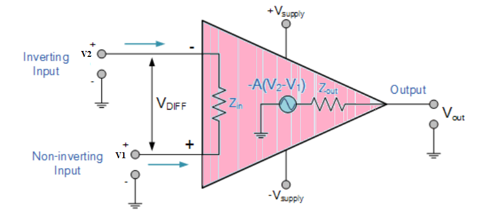
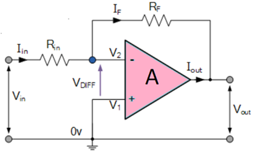
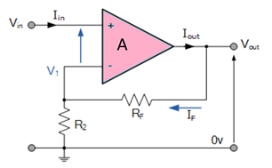

# Theory

Operational Amplifier commonly known as Op-Amp, is a linear elcectronic device having three terminals, two high impedence input and one output terminal. Op-Amp can perform multiple function when attached to diffrent feedback combinations like resistive, capacitive or both. Generally it is used as voltage amplifier and the output voltage of the Op-Amp is the diffrence between the voltages at its two input terminals.

Op-Amp shows some properties that make it an ideal amplifier, its open loop gain and input impedance is infinite (i.e.,practically very high), Output impedance and offset voltage is zero(i.e.,practically very low) and bandwidth is infinite(i.e.,practically limitted to frequency where its gain become unity).

Figure 1  

### Inverting Op-Amp

The open loop gain(Ao) of the Om-Apm is very high which makes it very unstable, so to make it stable with a controlable gain, a feed back is applied through some external resistor(Rf) from its output to inverting input terminal(i.e.,also known as negative feedback) resulting in reduced gain(cloosed loop gain, Av). So the voltage at inverting terminal is now the sum of the actual input and feedback voltages, and to separate both a input resistor(Ri) is introduced in the circuit. The non inverting terminal of the opamp is grounded, and the inverting terminal behaves like a virtual ground as the junction of the input and feedback signal are at the same potential.

Figure 2  

Current can be given 
       $$I=\frac{(V_{in}-V_{out})}{(R_{in}+R_F)}$$                                   
or, $$I=\frac{(V_{in}-V_2)}{R_{in}}$$                                                                       
or, $$I=\frac{(V_2-V_{out})}{R_F}$$                                                                     

$$I=\frac{V_{in}}{R_{in}}-\frac{V_2}{R_{in}}=\frac{V_2}{R_F}-\frac{V_{out}}{R_F}$$   

So,  $$\frac{V_{in}}{R_{in}}= V2\times (\frac{1}{R_{in}}+\frac{1}{R})- \frac{V_{out}}{R_F}$$       
and as, V2 =0 
    $$  I =\frac{(V_{in}-0)}{Rin}=\frac{(0-V_{out})}{R_F}$$ 
or, $$ \frac{R_F}{R_{in}} = -  \frac{V_{out}}{V_{in}}$$       			                 
The close loop gain (Acl) is given by :- 
$$A_{cl}= \frac{V_{out}}{V_{in}}  = - \frac{R_F}{R_{in}}$$
Output voltage (Vout) is given by :-
$$V_{out} =  -\frac{R_F}{R_{in} } \times V_{in}$$ 

### Non-Inverting Op-Amp

1. In this configuration of Op-amp the input signal is directly fed to the non inverting terminal resulting in a positive gain and output voltage in phase with input as compared to inverting Op-amp where the gain is negative and output voltage is out of phase with input , and to stabalize the circuit a negative feedback is applied through a resistor(Rf) and the inverting terminal is grounded witha input resistor(R2).This inverting Op-Amp like layout the at inverting terminal creates a virtual ground at the summing point make the Rf and R2 a potential divider accross inverting terminal, Hence determines the gain of the circuit.

Figure 3  

Potential difference V1 can be written as
       $$V_1 = \frac{R_2}{(R_2+R_F)}\times V_{out}$$		
in ideal condition : V1=Vin
So, $$V_{in} = \frac{R_2}{(R_2+R_F)}\times V_{out}$$       
and as we know Gain $$A_{cl}=\frac{V_{out}}{V_{in}}$$
$$A_{cl}=  \frac{V_{out}}{V_{in}} = \frac{(R_2+R_F)}{R_2} = 1+\frac{R_F}{R_2}$$   
and Output Voltage Vout is given by:
$$V_{out} =[1+\frac{R_F}{R_2}]*V_{in}$$ 

